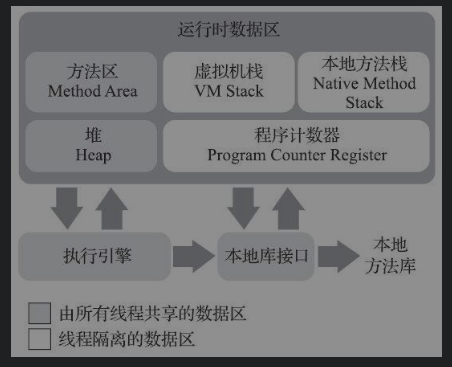

# Java内存区域与内存溢出异常

## JVM中的内存的各个区域

### 运行时数据区域

JVM在执行Java程序的过程中会把它所管理的内存划分为若干个不同的数据区域。这些区域有各自的用途，以及创建和销毁的时间，有的区域随着虚拟机进程的启动而一直存在，有些区域则是依赖用户线程的启动和结束而建立和销毁。

运行时数据区域包括

1. 方法区
2. 堆
3. 程序计数器
4. 虚拟机栈
5. 本地方法栈

------

### 1.程序计数器

> 与CPU中的程序计数器作用相同

程序计数器（Program Counter Register）是一块较小的内存空间，它可以看作是当前线程所执行的字节码的行号指示器。在Java虚拟机的概念模型里，字节码解释器工作时就是通过改变这个计数器的值来选取下一条需要执行的字节码指令，它是程序控制流的指示器，分支、循环、跳转、异常处理、线程恢复等基础功能都需要依赖这个计数器来完成。

Java的多线程是通过`线程轮流切换`、`分配处理器执行时间`的方式来是现实的，也就是说**在任何一个确定的时刻，一个处理器（内核）都只会执行一条线程中的指令**。因此，为了线程切换后能恢复到正确的执行位置，每条线程都需要有一个独立的程序计数器，各条线程之间计数器互不影响，独立存储，我们称这类内存区域为`“线程私有”`的内存。

如果线程正在执行的是一个Java方法，这个计数器记录的是正在执行的虚拟机字节码指令的地址；如果正在执行的是本地（Native）方法，这个计数器值则应为空（Undefined）。

**程序计数器是为一一个在《Java虚拟机规范中没有规定任何`OutOfMemoryError`情况的区域**

------

### 2.Java虚拟机栈

> Java虚拟机栈和程序计数器是线程私有的

**Java虚拟机栈的生命周期与线程相同**

虚拟机栈描述的是Java方法执行的线程内存模型：每个方法被执行的时候，Java虚拟机都会同步创建一个栈帧（Stack Frame）用于`存储局部变量表`、`操作数栈`、`动态连接`、`方法出口`等信息。每一个方法被调用直至执行完毕的过程，就对应着一个栈帧在虚拟机栈中从入栈到出栈的过程。

> 与计组中的栈帧相似

**Java内存区中的栈指的就是虚拟机栈， 更多的情况下讲的只是悉尼及栈中的局部变量表**

#### 2.1 局部变量表

局部变量表存放了编译期可知的各种Java虚拟机基本数据类型（boolean、byte、char、short、int、float、long、double）、对象引用（reference类型，它并不等同于对象本身，可能是一个指向对象起始地址的引用指针，也可能是指向一个代表对象的句柄或者其他与此对象相关的位置）和returnAddress类型（指向了一条字节码指令的地址）

这些数据类型在局部变量表中的存储空间以局部变量槽（Slot）来表示，其中`64位长度`的`long`和`double`类型的数据会占用`两个变量槽`，其余的数据类型只占用一个。*局部变量表所需的内存空间在`编译期间`完成分配*，当进入一个方法时，这个方法需要在栈帧中分配多大的局部变量空间是完全确定的，在方法运行期间不会改变局部变量表的大小。请读者注意，这里说的“大小”是指变量槽的数量，虚拟机真正使用多大的内存空间（譬如按照1个变量槽占用32个比特、64个比特，或者更多）来实现一个变量槽，这是完全由具体的虚拟机实现自行决定的事情。

> 变量槽的大小取决于虚拟机

##### 虚拟机栈可能引起的异常状况

1. 如果线程请求的栈深度大于`虚拟机所允许的深度`，将抛出`StackOverflowError`异常；
2. 如果Java虚拟机栈容量可以动态扩展，当栈扩展时`无法申请到足够的内存`会抛出`OutOfMemoryError`异常

------

### 3.本地方法栈

本地方法栈（Native Method Stacks）与虚拟机栈所发挥的作用是非常相似的，其区别只是虚拟机栈为虚拟机执行Java方法（也就是字节码）服务，而本地方法栈则是为虚拟机使用到的本地（Native）方法服务。

有些虚拟机会把本地方法栈和虚拟机栈合二为一

> 异常抛出

本地方法栈也会在栈深度溢出StackOverflowError
栈扩展失败时抛出和OutOfMemoryError异常

------

### 4.Java堆

Java堆是Java程序中最大的一块，Java堆是**被所有线程共享的一块区域**，此内存区域的唯一目的就是存放对象实例，Java世界里“几乎”所有的对象实例都在这里分配内存。Java堆是**垃圾收集器管理的内存区域**，因此一些资料中它也被称作`GC堆`

从回收内存的角度看，由于现代垃圾收集器大部分都是基于分代收集理论设计的，所以Java堆中经常会出现`新生代` `老年代` `永久代` `Eden空间` `From Survivor空间` `To Survivor空间`等

如果从分配内存的角度看，所有线程共享的Java堆中可以划分出多个线程私有的分配缓冲区（Thread LocalAllocation Buffer，TLAB），以提升对象分配时的效率。不过无论从什么角度，**无论如何划分，都不会改变Java堆中存储内容的共性**，无论是哪个区域，存储的都只能是对象的实例，将Java堆细分的目的只是为了更好地回收内存，或者更快地分配内存。

Java堆可以处于物理上不连续的内存空间中，但在逻辑上它应该被视为连续的，这点就像我们用磁盘空间去存储文件一样，并不要求每个文件都连续存放。但对于大对象（**典型的如数组对象**），多数虚拟机实现出于实现简单、存储高效的考虑，很可能会要求连续的内存空间。

Java堆既可以被实现成固定大小的，也可以是可扩展的，不过当前主流的Java虚拟机都是按照可扩展来实现的
如果在Java堆中没有内存完成实例分配，并且堆也无法再扩展时，Java虚拟机将会抛出`OutOfMemoryError`异常。

### 5. 方法区

> 方法区（Method Area）与Java堆一样，是各个线程共享的内存区域

用于存储已被虚拟机加载的类型信息、常量、静态变量、即时编译器编译后的代码缓存等数据。虽然《Java虚拟机规范》中把方法区描述为堆的一个逻辑部分，但是它却有一个别名叫作`非堆`（Non-Heap），目的是与Java堆区分开来。

方法区的约束是非常宽松的，除了和Java堆一样不需要连续的内存和可以选择固定大小或者可扩展外，甚至还可以选择不实现垃圾收集。

这区域的内存回收目标主要是针对常量池的回收和对类型

如果方法区无法满足新的内存分配需求时，将抛出OutOfMemoryError异常

### 6.运行时常量池

运行时常量池（Runtime Constant Pool）是方法区的一部分。Class文件中除了有类的版本、字段、方法、接口等描述信息外，还有一项信息是常量池表（Constant PoolTable），用于存放编译期生成的各种字面量与符号引用，这部分内容将在类加载后存放到方法区的运行时常量池中。

> 一般来说，除了保存Class文件中描述的符号引用外，还会把由符号引用翻译出来的直接引用也存储在运行时常量池中

运行时常量池相对于Class文件常量池的另外一个重要特征是具备动态性，Java语言并不要求常量一定只有编译期才能产生，也就是说，并非预置入Class文件中常量池的内容才能进入方法区运行时常量池，运行期间也可以将新的常量放入池中，这种特性被开发人员利用得比较多的便是String类的intern()方法。

既然运行时常量池是方法区的一部分，自然受到方法区内存的限制，当常量池无法再申请到内存时会抛出`OutOfMemoryError`异常

### 7. 直接内存

> 直接内存（Direct Memory）并不是虚拟机运行时数据区的一部分，也不是《Java虚拟机规范》中定义的内存区域。

本机直接内存的分配不会受到Java堆大小的限制，但是，既然是内存，则肯定还是会受到本机总内存（包括物理内存、SWAP分区或者分页文件）大小以及处理器寻址空间的限制，一般服务器管理员配置虚拟机参数时，会根据实际内存去设置-Xmx等参数信息，但经常忽略掉直接内存，使得各个内存区域总和大于物理内存限制（包括物理的和操作系统级的限制），从而导致动态扩展时出现`OutOfMemoryError`异常。